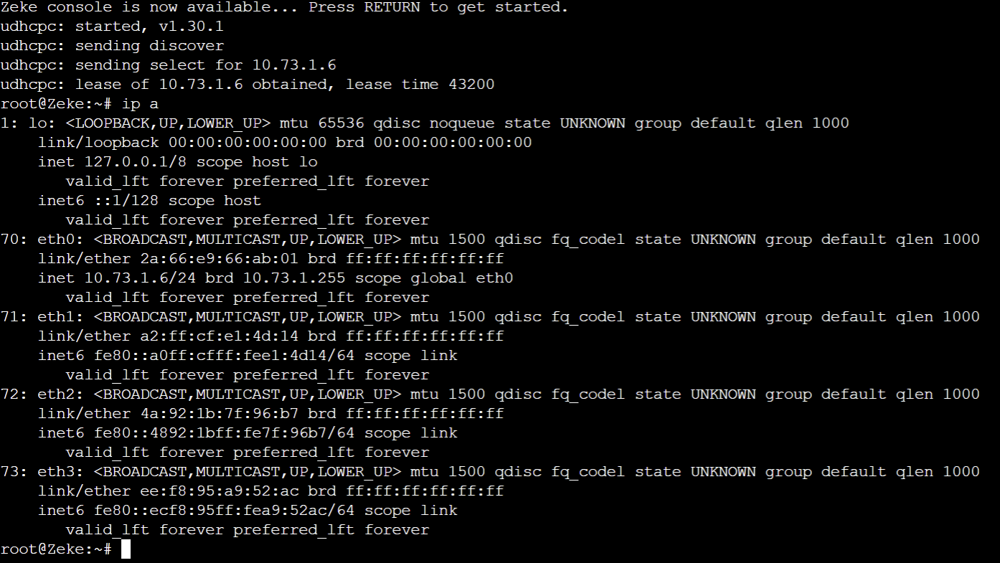

# Modul 3 Jarkom

| Name               |      NRP    |
|--------------------|-------------|
| Fiorenza Adelia Nalle | 5027231053 |

## Daftar Isi

1. [Soal 1](#soal-1)
2. [Soal 2](#soal-2)
3. [Soal 3](#soal-3)
4. [Soal 4](#soal-4)
5. [Soal 5](#soal-5)
6. [Soal 6](#soal-6)
7. [Soal 7](#soal-7)
8. [Soal 8](#soal-8)
9. [Soal 9](#soal-9)
10. [Soal 10](#soal-10)
11. [Soal 11](#soal-11)
12. [Soal 12](#soal-12)
13. [Soal 13](#soal-13)

## Konfigurasi Node


Paradis (Router (DHCP Relay))

```jsx
auto eth0
iface eth0 inet dhcp
up iptables -t nat -A POSTROUTING -o eth0 -j MASQUERADE

auto eth1
iface eth1 inet static
	address 10.73.1.1
	netmask 255.255.255.0

auto eth2
iface eth2 inet static
	address 10.73.2.1
	netmask 255.255.255.0

auto eth3
iface eth3 inet static
	address 10.73.3.1
	netmask 255.255.255.0

auto eth4
iface eth4 inet static
	address 10.73.4.1
	netmask 255.255.255.0
```

Tybur (DHCP Server)

---

```jsx
auto eth0
iface eth0 inet static
	address 10.73.4.2
	netmask 255.255.255.0
	gateway 10.73.4.1

up echo nameserver 192.168.122.1 > /etc/resolv.conf
```

Fritz (DNS Server)

```jsx
auto eth0
iface eth0 inet static
	address 10.73.4.3
	netmask 255.255.255.0
	gateway 10.73.4.1

up echo nameserver 192.168.122.1 > /etc/resolv.conf
```

Warhammer (Database Server)

```jsx
auto eth0
iface eth0 inet static
	address 10.73.3.4
	netmask 255.255.255.0
	gateway 10.73.3.1
	
up echo nameserver 192.168.122.1 > /etc/resolv.conf
```

Beast (Load Balancer Laravel)

```jsx
auto eth0
iface eth0 inet static
	address 10.73.3.2
	netmask 255.255.255.0
	gateway 10.73.3.1
	
up echo nameserver 192.168.122.1 > /etc/resolv.conf
```

Colossal (Load Balancer PHP)

```jsx
auto eth0
iface eth0 inet static
	address 10.73.3.3
	netmask 255.255.255.0
	gateway 10.73.3.1
up echo nameserver 192.168.122.1 > /etc/resolv.conf
```

Annie (Laravel Worker)

```jsx
auto eth0
iface eth0 inet static
	address 10.73.1.2
	netmask 255.255.255.0
	gateway 10.73.1.1
up echo nameserver 192.168.122.1 > /etc/resolv.conf
```

Bertholdt (Laravel Worker)

```jsx
auto eth0
iface eth0 inet static
	address 10.73.1.3
	netmask 255.255.255.0
	gateway 10.73.1.1
up echo nameserver 192.168.122.1 > /etc/resolv.conf
```

Reiner (Laravel Worker)

```jsx
auto eth0
iface eth0 inet static
	address 10.73.1.4
	netmask 255.255.255.0
	gateway 10.73.1.1
up echo nameserver 192.168.122.1 > /etc/resolv.conf
```

Armin (PHP Worker)

```jsx
auto eth0
iface eth0 inet static
	address 10.73.2.2
	netmask 255.255.255.0
	gateway 10.73.2.1
up echo nameserver 192.168.122.1 > /etc/resolv.conf
```

Eren (PHP Worker)

```jsx
auto eth0
iface eth0 inet static
	address 10.73.2.3
	netmask 255.255.255.0
	gateway 10.73.2.1
up echo nameserver 192.168.122.1 > /etc/resolv.conf
```

Mikasa (PHP Worker)

```jsx
auto eth0
iface eth0 inet static
	address 10.73.2.2
	netmask 255.255.255.0
	gateway 10.73.2.1
up echo nameserver 192.168.122.1 > /etc/resolv.conf
```

Zeke (Client)

```jsx
auto eth0
iface eth0 inet dhcp
```

Erwin (Client)

```jsx
auto eth0
iface eth0 inet dhcp
```

---

## Soal 0

1. Pulau Paradis telah menjadi tempat yang damai selama 1000 tahun, namun kedamaian tersebut tidak bertahan selamanya. Perang antara kaum Marley dan Eldia telah mencapai puncak. Kaum Marley yang dipimpin oleh Zeke**,** me-register domain name **marley.yyy.com** untuk worker Laravel mengarah pada **Annie**. Namun ternyata tidak hanya kaum Marley saja yang berinisiasi, kaum Eldia ternyata sudah mendaftarkan domain name **eldia.yyy.com** untuk worker PHP **(0)** mengarah pada **Armin.**

Pada DNS Server atau Fritz

```jsx
apt-get update
apt-get install bind9 -y
```

```jsx
service bind9 start
```

```jsx
nano /etc/bind/named.conf.local

zone "marley[.it19.com](http://harkonen.it02.com/)" {
		type master;
		file "/etc/bind/it19/marley.it19.com";
};

zone "eldia[.it19.com](http://harkonen.it02.com/)" {
		type master;
		file "/etc/bind/it19/eldia.it19.com";
};
```

```jsx
mkdir /etc/bind/it19
```

```jsx
nano /etc/bind/it19/marley.it19.com
```

```jsx
$TTL    604800
@       IN      SOA     marley.it19.com. root.marley.it19.com. (
                        2				; Serial
                        604800			; Refresh
                        86400			; Retry
                        2419200         ; Expire
                        604800 )		; Negative Cache TTL
;
@		IN      NS      marley.it19.com.
@		IN      A       10.73.1.2
www		IN      CNAME   marley.it19.com.
```

```jsx
nano /etc/bind/it19/eldia.it19.com
```

```jsx
$TTL    604800
@       IN      SOA     eldia.it19.com. root.eldia.it19.com. (
                        2				; Serial
                        604800			; Refresh
                        86400			; Retry
                        2419200         ; Expire
                        604800 )		; Negative Cache TTL
;
@		IN      NS      eldia.it19.com.
@		IN      A       10.73.2.2
www		IN      CNAME   eldia.it19.com.
```

```jsx
service bind9 restart
```

## Soal 1

1. Lakukan konfigurasi sesuai dengan peta yang sudah diberikan.
    1. Semua **Client** harus menggunakan konfigurasi ip address dari keluarga **Tybur (dhcp)**.

Setup DHCP Server atau Tybur

```jsx
apt-get update
apt-get install isc-dhcp-server -y
```

```jsx
nano /etc/default/isc-dhcp-server

INTERFACES="eth0"
```

```jsx
nano /etc/dhcp/dhcpd.conf

subnet 10.73.1.0 netmask 255.255.255.0 {
	option routers 10.73.1.0;
	option broadcast-address 10.73.1.255;
	option domain-name-servers 10.73.4.3;
}

subnet 10.73.2.0 netmask 255.255.255.0 {
	option routers 10.73.2.0;
	option broadcast-address 10.73.4.255;
	option domain-name-servers 10.73.4.3;
}

subnet 10.73.3.0 netmask 255.255.255.0 {}

subnet 10.73.4.0 netmask 255.255.255.0 {}
```

```jsx
service isc-dhcp-server restart
```

Setup DHCP Relay atau Paradis

```jsx
apt-get update
apt-get install isc-dhcp-relay -y
```

```jsx
service isc-dhcp-relay start
```

```jsx
nano /etc/default/isc-dhcp-relay

SERVERS="10.73.4.2"
INTERFACES="eth1 eth2 eth3 eth4"
OPTIONS=""
```

```jsx
nano /etc/sysctl.conf

net.ipv4.ip_forward=1
```

```jsx
service isc-dhcp-relay restart
```

## Soal 2

1. **Client** yang melalui bangsa marley mendapatkan range IP dari [prefix IP].1.05 - [prefix IP].1.25 dan [prefix IP].1.50 - [prefix IP].1.100 **(2)**

Pada tybur

```jsx
nano /etc/dhcp/dhcpd.conf
```

```jsx
subnet 10.73.1.0 netmask 255.255.255.0 {
	range 10.73.1.05 10.73.1.25;
	range 10.73.1.50 10.73.1.100;
	option routers 10.73.1.0;
	option broadcast-address 10.73.1.255;
}
```

```jsx
service isc-dhcp-server restart
```

## Soal 3

1. **Client** yang melalui bangsa eldia mendapatkan range IP dari [prefix IP].2.09 - [prefix IP].2.27 dan [prefix IP].2 .81 - [prefix IP].2.243 **(3)**

Pada tybur

```jsx
nano /etc/dhcp/dhcpd.conf
```

```jsx
subnet 10.73.2.0 netmask 255.255.255.0 {
	range 10.73.2.09 10.73.2.27;
	range 10.73.2.81 10.73.2.243;
	option routers 10.73.2.0;
	option broadcast-address 10.73.2.255;
}
```

```jsx
service isc-dhcp-server restart
```

Cek di masing masing client




## Soal 4

1. **Client** mendapatkan DNS dari keluarga **Fritz** dan dapat terhubung dengan internet melalui DNS tersebut **(4)**

Tybur

```jsx
nano /etc/dhcp/dhcpd.conf
```

```jsx
subnet 10.73.1.0 netmask 255.255.255.0 {
  range 10.73.1.05 10.73.1.25;
	range 10.73.1.50 10.73.1.100;
	option routers 10.73.1.1;
	option broadcast-address 10.73.1.255;
	option domain-name-servers 10.73.4.3;
}

subnet 10.73.2.0 netmask 255.255.255.0 {
	range 10.73.2.09 10.73.2.27;
	range 10.73.2.81 10.73.2.243;
	option routers 10.73.2.1;
	option broadcast-address 10.73.2.255;
	option domain-name-servers 10.73.4.3;
}

subnet 10.73.3.0 netmask 255.255.255.0 {}

subnet 10.73.4.0 netmask 255.255.255.0 {}
```

```jsx
service isc-dhcp-server restart
```

Fritz

```jsx
nano /etc/bind/named.conf.options

options {
        directory "/var/cache/bind";

        forwarders {
            192.168.122.1;
        };

        allow-query{any;};

        auth-nxdomain no;    # conform to RFC1035
        listen-on-v6 { any; };
};
```

```jsx
service bind9 restart
```


## Soal 5

1. Dikarenakan keluarga **Tybur** tidak menyukai kaum **eldia,** maka mereka hanya meminjamkan ip address ke kaum **eldia** selama 6 menit. Namun untuk kaum **marley**, keluarga **Tybur** meminjamkan ip address selama 30 menit. Waktu maksimal dialokasikan untuk peminjaman alamat IP selama 87 menit. **(5)**

Pada Tybur

```jsx
nano /etc/dhcp/dhcpd.conf
```

```jsx
subnet 10.73.1.0 netmask 255.255.255.0 {
  range 10.73.1.05 10.73.1.25;
	range 10.73.1.50 10.73.1.100;
	option routers 10.73.1.1;
	option broadcast-address 10.73.1.255;
	option domain-name-servers 10.73.4.3;
	default-lease-time 1800;
	max-lease-time 5220;
}

subnet 10.73.2.0 netmask 255.255.255.0 {
	range 10.73.1.05 10.73.1.25;
	range 10.73.1.50 10.73.1.100;
	option routers 10.73.2.1;
	option broadcast-address 10.73.4.255;
	option domain-name-servers 10.73.4.3;
	default-lease-time 360;
	max-lease-time 5220;
}

subnet 10.73.3.0 netmask 255.255.255.0 {}

subnet 10.73.4.0 netmask 255.255.255.0 {}
```

```jsx
service isc-dhcp-server restart
```


Seiring berjalannya waktu kondisi semakin memanas, untuk bersiap perang. Kaum **Eldia** melakukan deployment sebagai berikut

Image

---

danielcristh0/debian-buster:1.1

---

## Soal 6

1. Armin berinisiasi untuk memerintahkan setiap worker PHP untuk melakukan konfigurasi virtual host untuk website berikut [https://intip.in/BangsaEldia](https://intip.in/BangsaEldia) dengan menggunakan php 7.3 (6)

Setup PHP Worker (Armin, Eren, Mikasa)

```jsx
#!/bin/bash

# Update package list and install necessary packages
apt-get update
apt-get install lynx nginx wget unzip php7.3 php-fpm -y

# Start PHP-FPM and Nginx services
service php7.3-fpm start
service nginx start

# Create download directory
mkdir -p /var/www/html/download/

# Download the ZIP file from Google Drive
wget --no-check-certificate 'https://drive.google.com/uc?export=download&id=1yliJkxu-3XmgJ6Xb37pGc2Jht5NTO9oj' -O /var/www/html/download/bangsa-eldia.zip

# Unzip the downloaded file
unzip /var/www/html/download/bangsa-eldia.zip -d /var/www/html/download

# Move extracted files to the web root
mv /var/www/html/download/bangsa-eldia/modul-3/* /var/www/html/

# Clean up by removing the download directory
rm -rf /var/www/html/download/

# Configure Nginx
cat <<EOL > /etc/nginx/sites-available/it19.conf
server {
    listen 80;

    root /var/www/html;

    index index.php index.html index.htm;

    server_name _;

    location / {
        try_files \$uri \$uri/ /index.php?\$query_string;
    }

    location ~ \.php$ {
        include snippets/fastcgi-php.conf;
        fastcgi_pass unix:/var/run/php/php7.3-fpm.sock;
    }

    error_log /var/log/nginx/it19_error.log;
    access_log /var/log/nginx/it19_access.log;
}
EOL

# Enable the site configuration
ln -s /etc/nginx/sites-available/it19.conf /etc/nginx/sites-enabled/

# Remove the default Nginx site
rm /etc/nginx/sites-enabled/default

# Restart Nginx and PHP-FPM services
service nginx restart
service php7.3-fpm restart

```

lynx 10.73.2.2


lynx 10.73.2.3


lynx 10.73.2.4


## Soal 7

1. Dikarenakan Armin sudah mendapatkan kekuatan titan colossal, maka bantulah kaum **eldia** menggunakan **colossal** agar dapat bekerja sama dengan baik. Kemudian lakukan testing dengan 6000 request dan 200 request/second. **(7)**

Pada Colossal

```jsx
apt-get update
apt-get install lynx nginx php7.3 php-fpm apache2-utils -y 
```

```jsx
service php7.3-fpm start
service nginx start
```

```jsx
nano /etc/nginx/sites-available/load-balancer-it19.conf

upstream worker {
    server 10.73.2.2;
    server 10.73.2.3;
    server 10.73.2.4;
}

server {
    listen 80;
    
    root /var/www/html;
    index index.html index.htm index.nginx-debian.html;
    server_name _;

    location / {
          proxy_pass http://worker;
          proxy_http_version 1.1;
          proxy_set_header Upgrade $http_upgrade;
	        proxy_set_header Connection 'upgrade';
          proxy_set_header Host $host;
          proxy_cache_bypass $http_upgrade;
    }
}
```

```jsx
ln -s /etc/nginx/sites-available/load-balancer-it19.conf /etc/nginx/sites-enabled
```

```jsx
rm /etc/nginx/sites-enabled/default
```

```jsx
service nginx restart
service php7.3-fpm restart
```


## Soal 8

1. Karena Erwin meminta “laporan kerja Armin”, maka dari itu buatlah analisis hasil testing dengan 1000 request dan 75 request/second untuk masing-masing algoritma Load Balancer dengan ketentuan sebagai berikut:
    1. Nama Algoritma Load Balancer
    2. Report hasil testing pada Apache Benchmark
    3. Grafik request per second untuk masing masing algoritma.
    4. Analisis **(8)**

Pada Colossal

Round Robin

```jsx
nano /etc/nginx/sites-available/load-balancer-it19.conf

upstream worker {
		# least_conn;
		# ip_hash;
		# hash $request_uri consistent;
    server 10.73.2.2;
    server 10.73.2.3;
    server 10.73.2.4;
    # server 10.73.2.2 weight=3;  
    # server 10.73.2.3 weight=2;  
    # server 10.73.2.4 weight=1;  
}

server {
    listen 80;
    
    root /var/www/html;
    index index.html index.htm index.nginx-debian.html;
    server_name _;

    location / {
          proxy_pass http://worker;
          proxy_http_version 1.1;
          proxy_set_header Upgrade $http_upgrade;
	        proxy_set_header Connection 'upgrade';
          proxy_set_header Host $host;
          proxy_cache_bypass $http_upgrade;
    }
}
```

```jsx
service nginx restart
```


Weighted round robin

```jsx
nano /etc/nginx/sites-available/load-balancer-it19.conf

upstream worker {
		# least_conn;
		# ip_hash;
		# hash $request_uri consistent;
    # server 10.73.2.2;
    # server 10.73.2.3;
    # server 10.73.2.4;
    server 10.73.2.2 weight=3;  
    server 10.73.2.3 weight=2;  
    server 10.73.2.4 weight=1;  
}

server {
    listen 80;
    
    root /var/www/html;
    index index.html index.htm index.nginx-debian.html;
    server_name _;

    location / {
          proxy_pass http://worker;
          proxy_http_version 1.1;
          proxy_set_header Upgrade $http_upgrade;
	        proxy_set_header Connection 'upgrade';
          proxy_set_header Host $host;
          proxy_cache_bypass $http_upgrade;
    }
}
```

```jsx
service nginx restart
```


Weighted least connection

```jsx
nano /etc/nginx/sites-available/load-balancer-it19.conf

upstream worker {
		least_conn;
		# ip_hash;
		# hash $request_uri consistent;
    # server 10.73.2.2;
    # server 10.73.2.3;
    # server 10.73.2.4;
    server 10.73.2.2 weight=3;  
    server 10.73.2.3 weight=2;  
    server 10.73.2.4 weight=1;  
}

server {
    listen 80;
    
    root /var/www/html;
    index index.html index.htm index.nginx-debian.html;
    server_name _;

    location / {
          proxy_pass http://worker;
          proxy_http_version 1.1;
          proxy_set_header Upgrade $http_upgrade;
	        proxy_set_header Connection 'upgrade';
          proxy_set_header Host $host;
          proxy_cache_bypass $http_upgrade;
    }
}
```

```jsx
service nginx restart
```


Least connection

```jsx
nano /etc/nginx/sites-available/load-balancer-it19.conf

upstream worker {
		least_conn;
		# ip_hash;
		# hash $request_uri consistent;
    server 10.73.2.2;
    server 10.73.2.3;
    server 10.73.2.4;
}

server {
    listen 80;
    
    root /var/www/html;
    index index.html index.htm index.nginx-debian.html;
    server_name _;

    location / {
          proxy_pass http://worker;
          proxy_http_version 1.1;
          proxy_set_header Upgrade $http_upgrade;
	        proxy_set_header Connection 'upgrade';
          proxy_set_header Host $host;
          proxy_cache_bypass $http_upgrade;
    }
}
```

```jsx
service nginx restart
```


IPHash

```jsx
nano /etc/nginx/sites-available/load-balancer-it19.conf

upstream worker {
		# least_conn;
		ip_hash;
		# hash $request_uri consistent;
    server 10.73.2.2;
    server 10.73.2.3;
    server 10.73.2.4;
}

server {
    listen 80;
    
    root /var/www/html;
    index index.html index.htm index.nginx-debian.html;
    server_name _;

    location / {
          proxy_pass http://worker;
          proxy_http_version 1.1;
          proxy_set_header Upgrade $http_upgrade;
	        proxy_set_header Connection 'upgrade';
          proxy_set_header Host $host;
          proxy_cache_bypass $http_upgrade;
    }
}
```

```jsx
service nginx restart
```


Hash

```jsx
nano /etc/nginx/sites-available/load-balancer-it19.conf

upstream worker {
		# least_conn;
		# ip_hash;
		hash $request_uri consistent;
    server 10.73.2.2;
    server 10.73.2.3;
    server 10.73.2.4;
}

server {
    listen 80;
    
    root /var/www/html;
    index index.html index.htm index.nginx-debian.html;
    server_name _;

    location / {
          proxy_pass http://worker;
          proxy_http_version 1.1;
          proxy_set_header Upgrade $http_upgrade;
	        proxy_set_header Connection 'upgrade';
          proxy_set_header Host $host;
          proxy_cache_bypass $http_upgrade;
    }
}
```

```jsx
service nginx restart
```


Grafik


## Soal 9

1. Dengan menggunakan algoritma Least-Connection, lakukan testing dengan menggunakan 3 worker, 2 worker, dan 1 worker sebanyak 1000 request dengan 10 request/second, kemudian tambahkan grafiknya pada “laporan kerja Armin”. **(9)**

Pada Colossal

3 worker

```jsx
nano /etc/nginx/sites-available/load-balancer-it19.conf

upstream worker {
		least_conn;
    server 10.73.2.2;
    server 10.73.2.3;
    server 10.73.2.4;
}

server {
    listen 80;
    
    root /var/www/html;
    index index.html index.htm index.nginx-debian.html;
    server_name _;

    location / {
          proxy_pass http://worker;
          proxy_http_version 1.1;
          proxy_set_header Upgrade $http_upgrade;
	        proxy_set_header Connection 'upgrade';
          proxy_set_header Host $host;
          proxy_cache_bypass $http_upgrade;
    }
}
```

```jsx
service nginx restart
```


2 worker

```jsx
nano /etc/nginx/sites-available/load-balancer-it19.conf

upstream worker {
		least_conn;
    server 10.73.2.2;
    server 10.73.2.3;
    # server 10.73.2.4;
}

server {
    listen 80;
    
    root /var/www/html;
    index index.html index.htm index.nginx-debian.html;
    server_name _;

    location / {
          proxy_pass http://worker;
          proxy_http_version 1.1;
          proxy_set_header Upgrade $http_upgrade;
	        proxy_set_header Connection 'upgrade';
          proxy_set_header Host $host;
          proxy_cache_bypass $http_upgrade;
    }
}
```

```jsx
service nginx restart
```


1 worker

```jsx
nano /etc/nginx/sites-available/load-balancer-it19.conf

upstream worker {
		least_conn;
    server 10.73.2.2;
    # server 10.73.2.3;
    # server 10.73.2.4;
}

server {
    listen 80;
    
    root /var/www/html;
    index index.html index.htm index.nginx-debian.html;
    server_name _;

    location / {
          proxy_pass http://worker;
          proxy_http_version 1.1;
          proxy_set_header Upgrade $http_upgrade;
	        proxy_set_header Connection 'upgrade';
          proxy_set_header Host $host;
          proxy_cache_bypass $http_upgrade;
    }
}
```

```jsx
service nginx restart
```


Grafik


## Soal 10

1. Selanjutnya coba tambahkan keamanan dengan konfigurasi autentikasi di **Colossal** dengan dengan kombinasi username: “arminannie” dan password: “jrkmyyy”, dengan yyy merupakan kode kelompok. Terakhir simpan file “htpasswd” nya di /etc/nginx/supersecret/ **(10)**

Pada Colossal

```jsx
mkdir -p /etc/nginx/supersecret
```

```jsx
htpasswd -cb /etc/nginx/supersecret/htpasswd arminannie jrkmit19
```

```jsx
service php7.3-fpm start
service nginx start
```

```jsx
nano /etc/nginx/sites-available/load-balancer-it19.conf

upstream worker {
    server 10.73.2.2;
    server 10.73.2.3;
    server 10.73.2.4;
}

server {
    listen 80;
    
    root /var/www/html;
    index index.html index.htm index.nginx-debian.html;
    server_name _;

    location / {
          proxy_pass http://worker;
          proxy_http_version 1.1;
          proxy_set_header Upgrade $http_upgrade;
	        proxy_set_header Connection 'upgrade';
          proxy_set_header Host $host;
          proxy_cache_bypass $http_upgrade;
          auth_basic "Restricted Content";
	        auth_basic_user_file /etc/nginx/supersecret/htpasswd;
    }
}
```

```jsx
service nginx restart
service php7.3-fpm restart
```

lynx 10.73.3.3


## Soal 11

1. Lalu buat untuk setiap request yang mengandung /titan akan di proxy passing menuju halaman [https://attackontitan.fandom.com/wiki/Attack_on_Titan_Wiki](https://attackontitan.fandom.com/wiki/Attack_on_Titan_Wiki) **(11) hint: (proxy_pass)**

Pada Colossal

```jsx
nano /etc/nginx/sites-available/load-balancer-it19.conf

upstream worker {
    server 10.73.2.2;
    server 10.73.2.3;
    server 10.73.2.4;
}

server {
    listen 80;
    
    root /var/www/html;
    index index.html index.htm index.nginx-debian.html;
    server_name _;

    location / {
          proxy_pass http://worker;
          proxy_http_version 1.1;
          proxy_set_header Upgrade $http_upgrade;
	        proxy_set_header Connection 'upgrade';
          proxy_set_header Host $host;
          proxy_cache_bypass $http_upgrade;
          auth_basic "Restricted Content";
	        auth_basic_user_file /etc/nginx/supersecret/htpasswd;
    }
    
    location /titan {
          proxy_pass https://attackontitan.fandom.com/wiki/Attack_on_Titan_Wiki;
					proxy_set_header X-Real-IP $remote_addr;
					proxy_set_header X-Forwarded-For $proxy_add_x_forwarded_for;
					proxy_set_header X-Forwarded-Proto $scheme;
    }
}
```

```jsx
service nginx restart
service php7.3-fpm restart
```

lynx 10.73.3.3/titan


## Soal 12

1. Selanjutnya **Colossal** ini hanya boleh diakses oleh client dengan IP [Prefix IP].1.77, [Prefix IP].1.88, [Prefix IP].2.144, dan [Prefix IP].2.156. **(12) hint: (fixed in dulu clientnya)**

Pada Colossal

```jsx
nano /etc/nginx/sites-available/load-balancer-it19.conf

upstream worker {
    server 10.73.2.2;
    server 10.73.2.3;
    server 10.73.2.4;
}

server {
    listen 80;
    
    root /var/www/html;
    index index.html index.htm index.nginx-debian.html;
    server_name _;

    location / {
			    allow 10.73.1.77;
					allow 10.73.1.88;
					allow 10.73.2.144;
					allow 10.73.2.156;
					deny all;
		
          proxy_pass http://worker;
          proxy_http_version 1.1;
          proxy_set_header Upgrade $http_upgrade;
	        proxy_set_header Connection 'upgrade';
          proxy_set_header Host $host;
          proxy_cache_bypass $http_upgrade;
          auth_basic "Restricted Content";
	        auth_basic_user_file /etc/nginx/supersecret/htpasswd;
    }
    
    location /titan {
          proxy_pass https://attackontitan.fandom.com/wiki/Attack_on_Titan_Wiki;
					proxy_set_header X-Real-IP $remote_addr;
					proxy_set_header X-Forwarded-For $proxy_add_x_forwarded_for;
					proxy_set_header X-Forwarded-Proto $scheme;
    }
}
```

```jsx
service nginx restart
service php7.3-fpm restart
```

lynx 10.73.3.3 di kedua client


agar bisa diakses di client bisa dengan mengetahui terlebih dahulu ip client dengan command ip a


ipnya adalah 10.73.1.7 sehingga tambahkan ip tersebut ke load-balancer-it19.conf

```jsx
nano /etc/nginx/sites-available/load-balancer-it19.conf

upstream worker {
    server 10.73.2.2;
    server 10.73.2.3;
    server 10.73.2.4;
}

server {
    listen 80;
    
    root /var/www/html;
    index index.html index.htm index.nginx-debian.html;
    server_name _;

    location / {
			    allow 10.73.1.77;
					allow 10.73.1.88;
					allow 10.73.2.144;
					allow 10.73.2.156;
					allow 10.73.1.7;
					deny all;
		
          proxy_pass http://worker;
          proxy_http_version 1.1;
          proxy_set_header Upgrade $http_upgrade;
	        proxy_set_header Connection 'upgrade';
          proxy_set_header Host $host;
          proxy_cache_bypass $http_upgrade;
          auth_basic "Restricted Content";
	        auth_basic_user_file /etc/nginx/supersecret/htpasswd;
    }
    
    location /titan {
          proxy_pass https://attackontitan.fandom.com/wiki/Attack_on_Titan_Wiki;
					proxy_set_header X-Real-IP $remote_addr;
					proxy_set_header X-Forwarded-For $proxy_add_x_forwarded_for;
					proxy_set_header X-Forwarded-Proto $scheme;
    }
}
```

```jsx
service nginx restart
```

lynx 10.73.3.3 pada client


## Soal 13

1. Melihat perlawanan yang sengit dari kaum eldia, kaum marley pun memutar otak dan mengatur para worker di marley. Karena mengetahui bahwa ada keturunan marley yang mewarisi kekuatan titan, Zeke pun berinisiatif untuk menyimpan data data penting di **Warhammer**, dan semua data tersebut harus dapat diakses oleh anak buah kesayangannya, **Annie**, **Reiner**, dan **Berthold**. **(13)**

Pada Warhammer

```jsx
apt-get update
apt-get install mariadb-server -y
```

```jsx
service mysql start
```

```jsx
CREATE USER 'kelompokit19'@'%' IDENTIFIED BY 'passwordit19';
CREATE USER 'kelompokit19'@'localhost' IDENTIFIED BY 'passwordit19';
CREATE DATABASE dbkelompokit19;
GRANT ALL PRIVILEGES ON *.* TO 'kelompokit19'@'%';
GRANT ALL PRIVILEGES ON *.* TO 'kelompokit19'@'localhost';
FLUSH PRIVILEGES;
```

```jsx
SHOW DATABASES;
```

```jsx
nano /etc/mysql/my.cnf

[mysqld]
skip-networking=0
skip-bind-address
```

```jsx
service mysql restart
```

Pada laravel worker

```jsx
apt-get update
apt-get install mariadb-server -y
```

```jsx
mariadb --host=10.73.3.4 --port=3306 --user=kelompokit19 --password
```


